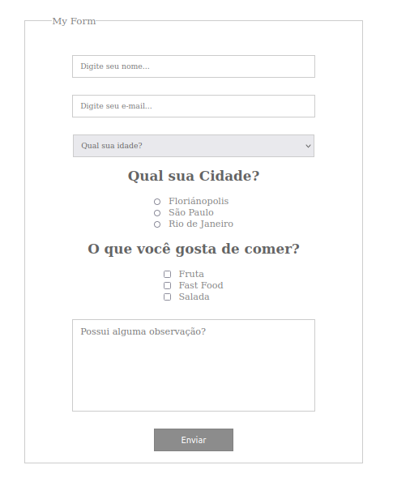

# Um **SIMPLES** formulartio responsivo...




### Codigo HTML

```
<!DOCTYPE html>
<html lang="en">
<head>
    <meta charset="UTF-8">
    <meta name="viewport" content="width=device-width, initial-scale=1.0">
    <title>Criando um Simples Formulario</title>
    <link rel="stylesheet" href="css/style.css">
</head>
<body>
    <form action="">
        <fieldset><!--A tag HTML <fieldset> é usada para agrupar elementos relacionados em um formulário.-->
            <legend>My Form</legend><!--A tag HTML <legend> é usada para fornecer uma legenda ou descrição para um elemento <fieldset> em um formulário.-->
                <div><input type="text" name="name" id="id" placeholder="Digite seu nome..."></div>
                <div><input type="text" name="name" id="id" placeholder="Digite seu e-mail..."></div>
                <div><select name="lista" id="id">
                    <option disabled selected>Qual sua idade?</option>
                    <option value="ll">20</option>
                    <option value="ll">25+</option>
                    <option value="ll">40+</option>
                </select></div>
                <h2>Qual sua Cidade?</h2>
                <div class="input">
                <div>
                    <input type="radio" name="cidade" id="id1" value=""><span>Floriánopolis</span>
                </div>
                <div>
                    <input type="radio" name="cidade" id="id1" value=""><span>São Paulo</span>
                </div>
                <div>
                    <input type="radio" name="cidade" id="id1" value=""><span>Rio de Janeiro</span>
                </div>
            </div>
            <h2>O que você gosta de comer?</h2>
            <div class="input">
            <div>
                <input type="checkbox" name="name" id="id1" value=""><span>Fruta</span>
            </div>
            <div>
                <input type="checkbox" name="name" id="id1" value=""><span>Fast Food</span>
            </div>
            <div>
                <input type="checkbox" name="name" id="id1" value=""><span>Salada</span>
            </div>
        </div>

        <div>
            <textarea name="" id="" cols="30" rows="10" placeholder="Possui alguma observação?"></textarea>
        </div>

        <div>
            <input type="submit" value="Enviar" name="acao">
        </div>
        </fieldset>
    </form>
</body>
</html>
```

### Codigo CSS

```
* {
    padding: 0;
    margin: 0;
}
html, body {
    height: 100%;
}
form {
    width: 96%;
    max-width: 600px;
    margin: 30px auto;
    text-align: center;
}
form fieldset{
    padding: 20px 48px;
    border: 1px solid #CCC;
}
form legend{
    font-size: 17px;
    color: rgb(130,130,130);
}
form input[type="text"]{
    font-family: tahoma;
    margin-top: 30px;
    width: 80%;
    display: inline-block;
    padding: 10px 13px;
    border: #CCC 1px solid;
}
form select{
    font-family: tahoma;
    width: calc(80% + 26px);
    margin-top: 30px;
    display: inline-block;
    padding: 10px 13px;
    border: #CCC 1px solid;
    color: rgb(100,100,100);
}
form input[type="text"]:focus, form select:focus, form textarea:focus{
    outline: none;
}
form h2{
    margin-top: 20px;
    color: rgb(100,100,100);
}
.input{
    margin-top: 20px;
    text-align: left;
    display: inline-block;
}
.input span{
    margin-left: 13px;
    font-size: 16px;
    color: rgb(130,130,130);
}
form input[type="submit"]{
    margin-top: 30px;
    border: none;
    background-color: rgb(140,140,140);
    color: #FFFFFF;
    font-size: 16px;
    border: 2px solid rgb(130,130,130);
    height: 40px;
    width: 140px;    
    cursor: pointer;
}
textarea{
    resize: none;
    width: 80%;
    padding: 10px 13px;
    margin-top: 30px;
    border: 1px solid #CCC;
    height: 140px;
    font-family: tahoma;
}
```